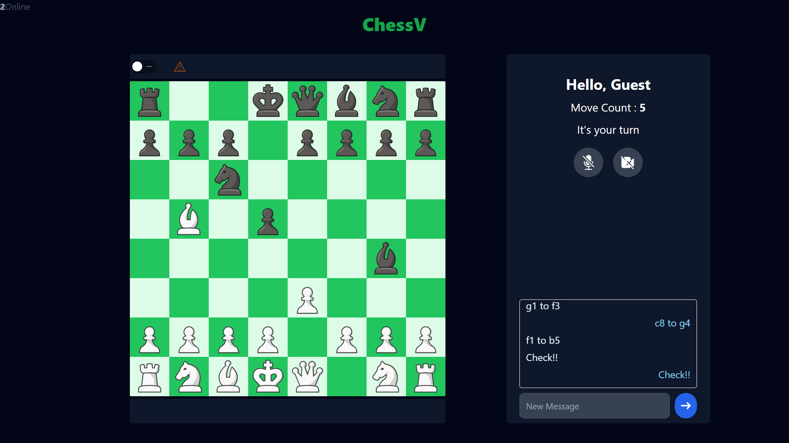
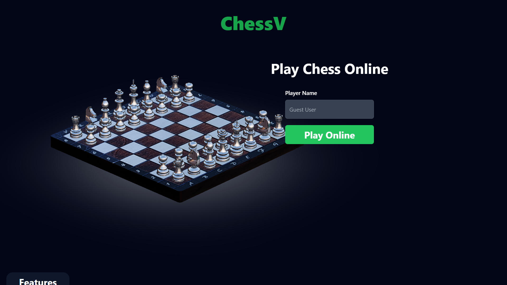

# Chess Web App

Welcome to the Chess Web App! This project is a real-time multiplayer chess game built using React.js for the front-end and Socket.io for real-time communication. 

## Table of Contents

- [Features](#features)
- [Backend](#backend)
- [Demo](#demo)
- [Installation](#installation)
- [Contributing](#contributing)
- [Technologies Used](#technologies-used)
- [Contact](#contact)

## Features

- **Real-time Multiplayer:** Play against other players online in real-time.
- **Real-time Chat:** Now you can chat with the opponent.
- **Betting Feature:** Players can bet on game using SOL (e.g., 0.1 SOL each), and the winner takes the entire pot.
- **Audio And Video Call:** Connect with your opponent via in-game audio and video calls feature.
- **Real-time Streaming:** Your game is Streaming continuously on the web app.
- **Custom Game Rooms:** Create custom game room with channelNumber and play with your friend.
- **Custom Game Stream:** Choose custom game to watch with channelNumber .
- **Responsive Design:** Fully responsive design that works on desktops, tablets, and mobile devices.

## Backend

[Backend Link](https://github.com/uditdev1/ChessWe-api)

## Demo

[Deployed link](https://chesswe.netlify.app/)




## Installation

To set up the project locally, you'll need to clone and run both the front-end and back-end repositories. Follow these steps:

### Front-end Back-end Setup

1. **Clone the Front-end Repository:**

   First, clone the repository for the front-end:

   ```bash
   git clone https://github.com/uditdev1/ChessWe_client.git
   cd Chess.v.0.2.1
   npm install 
   npm run dev

2. **Clone the Back-end Repository:**

   First, clone the repository for the front-end:

   ```bash
   git clone https://github.com/uditdev1/ChessWe_client.git
   cd chess-v2-api
   npm install 
   node src/server.js

2. **Set up environment variables:**
    remove .example from .env.example

## Contributing

I welcome contributions! If you have suggestions for improvements or new features, feel free to submit a pull request or open an issue.

Fork the repository
Create a new branch (git checkout -b feature-branch)
Make your changes
Commit your changes (git commit -m 'Add some feature')
Push to the branch (git push origin feature-branch)
Create a new Pull Request


## Technologies Used

Front-end:
    React.js
    Socket.io Client
    
Back-end:
    Node.js
    Socket.io Server
    WebRTC (used for audio and video calling)
    
Others:
    React Router
    Chess.js (chess logic library)
    React Chessboard (chessboard component)

## Contact
If you have any questions or need further information, feel free to contact me:

[LinkedIn](https://www.linkedin.com/in/uditdev1/)
